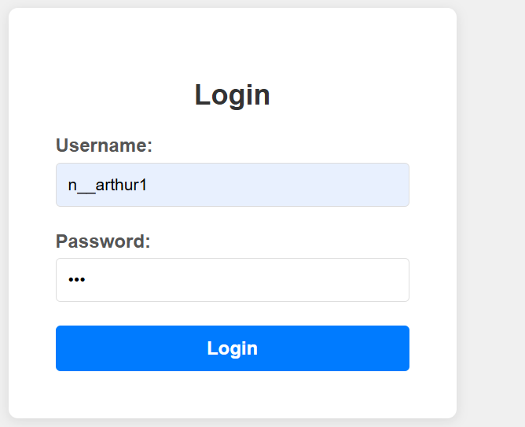
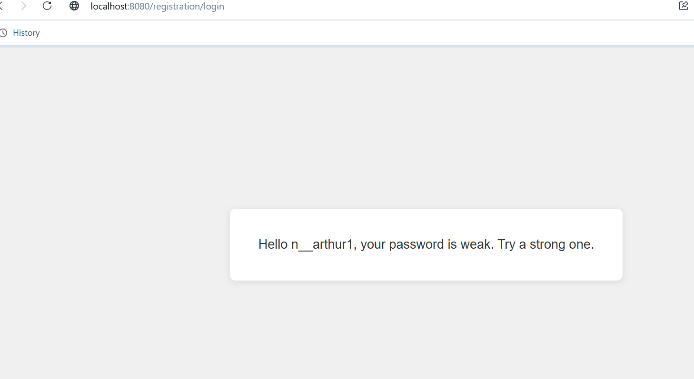
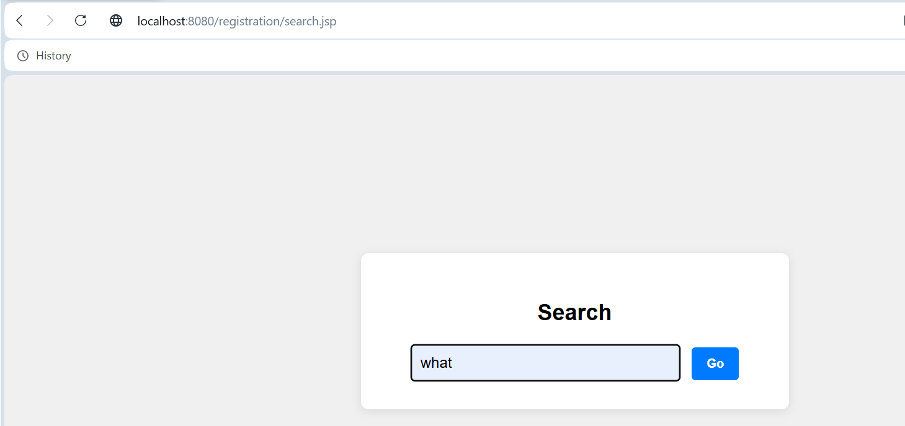

# Registration Webapp (Assignments)

Short guide for running and testing the simple servlet assignments.

**Author:** Ndatimana - Assa  
**Last Updated:** February 4, 2026

## Overview

- Assignment 1: Login Servlet
  - Page: `login.jsp`
  - POST target: `/login`
  - Behavior: if submitted password length &lt; 8 → shows
    `Hello <username>, your password is weak. Try a strong one.`
    otherwise → `Welcome <username>`

- Assignment 2: Send Redirect
  - Page: `search.jsp`
  - POST target: `/redirect`
  - Behavior: servlet redirects to Google search with the provided query

## Project structure

- `src/main/webapp/login.jsp` — login page
- `src/main/webapp/search.jsp` — search page
- `src/main/java/auca/rw/LoginServlet.java` — login handling
- `src/main/java/auca/rw/RedirectServlet.java` — redirect handling
- `src/main/webapp/WEB-INF/web.xml` — servlet mappings

## Requirements

- Java 8+ installed and `JAVA_HOME` set
- Maven installed

## Run (development)

Build and start the Jetty development server bundled via Maven:

```bash
cd "C:\Users\arthu\OneDrive\Desktop\New folder (6)\registration"
mvn clean package
mvn jetty:run
```

Open in your browser:

- Login page: http://localhost:8080/registration/login.jsp
- Search page: http://localhost:8080/registration/search.jsp

Stop the server with `Ctrl+C` in the terminal.

If you prefer the embedded-run approach used earlier, you can also run a custom runner with:

```bash
mvn clean compile exec:java -Dexec.mainClass=auca.rw.TomcatRunner
```

## Quick test steps

1. Visit the login page and submit a short password (e.g. `pass123`) → expect weak-password message.
2. Submit a password with 8+ characters → expect welcome message.
3. Visit the search page, enter `cats`, click Fetch → browser should redirect to Google search results for `cats`.

## Screenshot

### Login Page


### Login Page Result


### Search Page (with Fetch button)


### Search Results (Google redirect)


